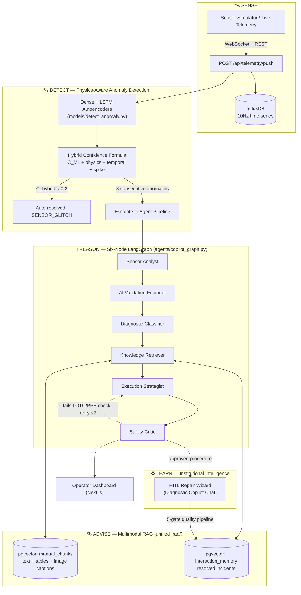
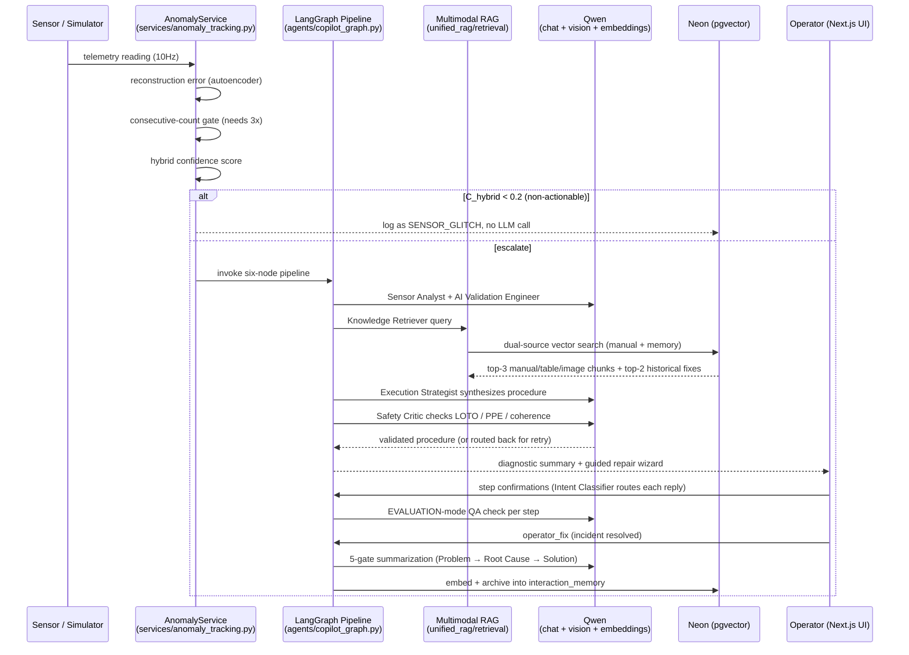

# Zynaptrix Industrial Copilot

**A neuro-symbolic agentic AI framework for industrial predictive maintenance** — physics-aware anomaly detection, a six-node multi-agent diagnostic pipeline, multimodal manual retrieval, and a self-improving institutional memory, all running on **Qwen** with a fully cloud-native data layer (**Cloudinary** + **Neon Postgres**, no local disk storage).

> Real-time SCADA-style telemetry in → dual-autoencoder anomaly detection → LangGraph multi-agent diagnosis → manual + diagram retrieval → safety-verified, step-by-step repair guidance → resolved incidents feed back into the knowledge base.

---

## Table of Contents

- [Overview](#overview)
- [System Architecture](#system-architecture)
- [End-to-End Flow](#end-to-end-flow)
- [Core Subsystems](#core-subsystems)
  - [1. Physics-Aware Anomaly Detection](#1-physics-aware-anomaly-detection)
  - [2. Six-Node LangGraph Multi-Agent Pipeline](#2-six-node-langgraph-multi-agent-pipeline)
  - [3. Multimodal RAG Engine](#3-multimodal-rag-engine)
  - [4. Institutional Intelligence](#4-institutional-intelligence)
- [Tech Stack](#tech-stack)
- [Project Structure](#project-structure)
- [API Reference](#api-reference)
- [Getting Started](#getting-started)
- [Cloud-Native Data Architecture](#cloud-native-data-architecture)

---

## Overview

Industrial facilities are monitored by SCADA/HMI systems that flood operators with raw telemetry but give almost no diagnostic help: a single sensor crossing a static threshold fires an alarm, and a technician is dispatched to manually dig through hundreds of pages of manuals under time pressure. Zynaptrix closes that gap by combining:

- **Sub-symbolic detection** — per-machine Dense + LSTM autoencoders trained only on healthy data, fused with manufacturer physics limits into a single hybrid confidence score.
- **Symbolic multi-agent reasoning** — a six-node LangGraph pipeline that classifies, retrieves, plans, and safety-checks a repair procedure before it ever reaches an operator.
- **Multimodal knowledge retrieval** — PDF manuals are parsed into text, tables, *and* vision-captioned diagrams, all living in one Qwen-embedded vector space, so a query can surface the right wiring diagram, not just the right paragraph.
- **Institutional memory** — every successfully resolved incident is quality-gated and vectorized, so the system gets better at diagnosing the *same* fleet of machines over time, without retraining.

The whole system is provider-agnostic by design (all AI calls flow through one client layer) and storage-agnostic by design (all persistent data lives in Cloudinary + Neon, nothing on local disk) — see [Cloud-Native Data Architecture](#cloud-native-data-architecture).

---

## System Architecture

The framework implements a five-pillar methodology — **Sense → Detect → Reason → Advise → Learn** — across four integrated subsystems.



---

## End-to-End Flow

A single incident, from a raw sensor tick to an entry in institutional memory:



**Two other flows worth knowing:**

- **Manual ingestion** (`POST /ingest-manual`): PDF uploaded → bytes read into memory → source PDF uploaded to Cloudinary → parsed via a momentary temp file (PyMuPDF + YOLOv8 layout detection + Camelot tables) → figures decomposed via Mobile SAM → each region captioned by Qwen-VL → everything chunked, embedded (`text-embedding-v4`), and stored in `manual_chunks` — no file is ever left on local disk.
- **Machine onboarding / training** (`POST /api/machines`): sensor datasheets parsed by Qwen → AI Automation Engineer validates/cross-checks sensor configs → synthetic training dataset generated and uploaded to Cloudinary → per-machine Dense + LSTM autoencoders trained → model/scaler uploaded to Cloudinary, thresholds written to Neon → evaluation run and results (metrics + charts) stored in Neon + Cloudinary.

---

## Core Subsystems

### 1. Physics-Aware Anomaly Detection

Each machine gets its own pair of autoencoders — `models/autoencoder_model.py` (Dense, point anomalies) and `models/lstm_autoencoder.py` (LSTM, temporal drift) — trained exclusively on `state == normal` readings via `models/train_model.py`. Inference (`models/detect_anomaly.py` + `models/model_registry.py`) computes reconstruction error `MSE(x)`, flags an anomaly above a calibrated `mean + 2σ` threshold, and derives a 0–100 health score.

A rolling per-machine counter (`services/anomaly_service.py`) requires **3 consecutive anomalous readings** before anything escalates — filtering transient noise before it costs an LLM call. On escalation, the **hybrid confidence formula** combines the ML score with manufacturer physics-limit violations (`services/sensor_config_loader.py`) and temporal trend confirmation:

```
C_hybrid = C_ML + α_phys + α_temp − β_spike
```

Readings scoring `C_hybrid < 0.2` are auto-classified `SENSOR_GLITCH` and never reach the agent pipeline at all.

### 2. Six-Node LangGraph Multi-Agent Pipeline

Implemented as inline nodes in `agents/copilot_graph.py`, sharing one immutable `CopilotState`:

| Node | Role |
|---|---|
| **Sensor Analyst** | Telemetry → natural-language severity assessment (FAULT/WARNING/NORMAL) |
| **AI Validation Engineer** | Physics checks + temporal analysis + hybrid confidence + Qwen classification → `TRUE_FAULT` / `SENSOR_GLITCH` / `NORMAL_WEAR` (see `agents/ai_automation_engineer.py`, `agents/validation_prompts.py`) |
| **Diagnostic Classifier** | Maps validated anomaly to severity (`CRITICAL`/`HIGH`), persists to `anomaly_records` |
| **Knowledge Retriever** | Provenance-checked, mode-aware call into the RAG engine (see below) |
| **Execution Strategist** | Synthesizes sensor data + retrieved manual + historical fixes into an operator-facing response, with inline `[IMAGE_N]` references |
| **Safety Critic** | Terminal gate — enforces LOTO/PPE/procedure coherence, bounded to 2 retry loops back to the Strategist, fail-safe `not_validated` flag on exhaustion |

Two chat surfaces sit on top of this graph:
- **Diagnostic Copilot Chat** (`app/copilot_api.py`) — anomaly-bound, drives the full six-node pipeline plus a real-time Intent Classifier (`CONFIRM_DONE` / `NEED_HELP` / `NEED_DETAIL` / `FREE_CHAT`) that routes operator replies during guided repair. `CONFIRM_DONE` is never trusted blindly — it's routed through `EVALUATION` mode for AI verification before the wizard advances.
- **Central Assistant** (`app/assistant_api.py`) — a freeform, session-based assistant with 5-intent routing (`GUIDE`/`ONBOARDING`/`RAG`/`SEARCH`/`CHAT`) independent of any specific incident.

### 3. Multimodal RAG Engine

Ingestion (`unified_rag/ingestion/`): `parser.py` (YOLOv8-DocLayNet layout detection + Camelot tables) → `captioner.py` (Qwen-VL diagram captioning) → `chunker.py` (500-word / 100-word-overlap sliding window with section metadata) → `embedder.py` (`text-embedding-v4`, 2048-dim). Composite technical drawings are decomposed component-by-component via `services/figure_splitter.py` (semantic center detection → Voronoi clustering → Mobile SAM masking) before captioning — so a single page with 4 sub-diagrams becomes 4 independently retrievable chunks instead of one generic caption.

Retrieval (`unified_rag/retrieval/retriever.py`, `rag.py`) runs three parallel searches per query:

| Search | Table | Filter | Top-K |
|---|---|---|---|
| Text + table chunks | `manual_chunks` | manual ID, type ∈ {text, table} | 3 |
| Image captions | `manual_chunks` | manual ID, type = image | 3 (dedup) |
| Historical fixes | `interaction_memory` | machine ID | 2 |

Five response modes: `SUMMARY`, `CONVERSATIONAL_WIZARD`, `CLARIFICATION`, `EVALUATION`, `PROCEDURE`.

### 4. Institutional Intelligence

Only Critic-approved, step-verified, operator-confirmed resolutions are archived (`services/incident_summarizer.py`), through 5 gates: Critic approval → per-step AI verification → explicit operator resolution → Qwen summarization (Problem → Root Cause → Solution) → embedding + archival into `interaction_memory`. Future incidents on the same/similar machines automatically surface these field-proven fixes alongside manual content — a bidirectional loop where the AI helps the operator, and the operator's field experience improves the AI's future answers, with zero retraining.

---

## Tech Stack

| Layer | Technology |
|---|---|
| Frontend | Next.js, TypeScript, Redux Toolkit, Recharts |
| Backend | FastAPI (Python), LangGraph, LangChain |
| **AI — Reasoning** | **Qwen `qwen-max`** (agents, RAG generation, incident summarization) |
| **AI — Lightweight tasks** | **Qwen `qwen-flash`** (intent classification, titling, table summarization) |
| **AI — Vision** | **Qwen-VL `qwen-vl-max`** (diagram/figure captioning) |
| **AI — Embeddings** | **Qwen `text-embedding-v4`** (2048-dim, unified text + image-caption space) |
| Relational + Vector DB | Neon (serverless PostgreSQL + pgvector) |
| Blob Storage | Cloudinary (manuals, figures, trained models/scalers, evaluation plots) |
| Time-Series | InfluxDB (real-time sensor telemetry) |
| Anomaly Models | TensorFlow / Keras (Dense + LSTM Autoencoders) |
| Document Parsing | PyMuPDF, YOLOv8 (DocLayNet), Mobile SAM, EasyOCR, Camelot |
| Deployment | Docker (`backend/Dockerfile`, `frontend/Dockerfile`) |

All AI calls route through `backend/unified_rag/ai_client.py` — one factory function and four named model constants (`MODEL_CHAT`, `MODEL_CHAT_LIGHT`, `MODEL_VISION`, `MODEL_EMBEDDING`). Swapping providers (e.g. to a self-hosted vLLM/Ollama endpoint) is a `.env` change, not a code change.

---

## Project Structure

```
zynaptrix-industrial-copilot-qwen-ai/
├── backend/
│   ├── agents/                  # LangGraph pipeline + validation/automation agents
│   │   ├── copilot_graph.py     #   six-node DAG definition
│   │   └── ai_automation_engineer.py
│   ├── app/                     # FastAPI routers
│   │   ├── main.py              #   app entrypoint, router registration, /api/telemetry/push
│   │   ├── copilot_api.py       #   /api/copilot/* — Diagnostic Copilot chat
│   │   ├── assistant_api.py     #   /api/assistant/* — Central Assistant
│   │   ├── machine_api.py       #   /api/machines/*, /api/chat-history/* — registry + onboarding
│   │   ├── evaluation_routes.py #   /api/evaluation/* — model metrics & plots
│   │   ├── simulator_api.py     #   /api/simulator/* — telemetry simulator control
│   │   └── websockets.py        #   live telemetry broadcast
│   ├── unified_rag/             # Multimodal RAG engine
│   │   ├── ingestion/           #   parser, chunker, captioner, pipeline
│   │   ├── retrieval/           #   retriever, rag generator (5 modes)
│   │   ├── embeddings/          #   Qwen embedding singleton
│   │   ├── db/                  #   SQLAlchemy models (Neon/pgvector)
│   │   └── ai_client.py         #   centralized Qwen client + model constants
│   ├── models/                  # Autoencoders, model_registry (cloud asset loading), evaluation
│   ├── preprocessing/           # Dataset normalization (cloud round-trip)
│   ├── services/                # Cloudinary/pipeline_storage, alerts, incident summarizer, sensor config
│   ├── simulator/                # Synthetic sensor data generator
│   ├── scripts/                 # Dataset generation, training orchestration, eval/benchmark tooling
│   └── config/                  # Sensor schema & machine-state config
└── frontend/
    ├── src/app/                 # Next.js pages: dashboard (/), /machines, /ingestion
    ├── src/components/          # Assistant sidebar, machine selector, procedure guide, etc.
    └── src/store/                # Redux slices: copilot, ingestion, machine, simulator
```

---

## API Reference

| Router | Prefix | Purpose |
|---|---|---|
| `unified_rag/api/endpoints.py` | `/ingest-manual`, `/machines`, `/chat` | Manual ingestion, lightweight machine CRUD, direct RAG chat |
| `app/copilot_api.py` | `/api/copilot` | `POST /invoke` (six-node pipeline), `/classify-intent`, `/chat/{id}`, `/chat/{id}/resolve` |
| `app/assistant_api.py` | `/api/assistant` | Central Assistant sessions, history, AI-generated reports |
| `app/machine_api.py` | `/api/machines`, `/api/chat-history` | Machine registration/onboarding (training pipeline trigger), resolve-with-feedback |
| `app/evaluation_routes.py` | `/api/evaluation` | Metrics summary, per-machine metrics, plot redirects, on-demand re-evaluation |
| `app/simulator_api.py` | `/api/simulator` | Start/stop synthetic telemetry, fault injection, machine sensor config |
| `app/websockets.py` | `/ws/*` | Live telemetry + anomaly alert broadcast |
| `app/main.py` | `/api/telemetry/push`, `/health` | Telemetry ingress, health check |

Full interactive docs at `http://localhost:8000/docs` once the backend is running.

---

## Getting Started

### Prerequisites
- Python 3.10+, Node.js 18+
- A [Neon](https://neon.tech) Postgres database (pgvector-enabled)
- A [Cloudinary](https://cloudinary.com) account
- A Qwen API key via [Alibaba Cloud Model Studio](https://modelstudio.console.alibabacloud.com/) (Singapore/international region for free trial quota)
- (Optional) InfluxDB Cloud, for high-frequency telemetry storage

### Backend

```bash
cd backend
python -m venv .venv
.\.venv\Scripts\Activate.ps1        # or `source .venv/bin/activate` on macOS/Linux
pip install -r requirements.txt

cp .env.example .env                # fill in AI_API_KEY, DATABASE_URL, CLOUDINARY_*, INFLUX_*
uvicorn app.main:app --reload
```
API docs: `http://localhost:8000/docs`

### Frontend

```bash
cd frontend
npm install
npm run dev
```
Dashboard: `http://localhost:3000`

### Bootstrapping data
- **Register a machine** via the `/machines` dashboard page (or `POST /api/machines`) with sensor datasheets — this triggers dataset generation, normalization, dual-autoencoder training, and evaluation automatically.
- **Ingest a manual** via the `/ingestion` dashboard page (or `POST /ingest-manual`) with a PDF — this runs the full multimodal ingestion pipeline.
- **Simulate telemetry** via `POST /api/simulator/start?machine_id=...` to see live anomaly detection and the agent pipeline in action without real hardware.

---

## Cloud-Native Data Architecture

Nothing generated or extracted by this system is written to local disk as persistent storage:

- **Cloudinary** holds every binary asset — source manual PDFs, extracted/captioned figures, trained model weights (`.keras`), scalers, and evaluation plots.
- **Neon (Postgres + pgvector)** holds every structured and vector record — machine registry, sensor configs, anomaly records, chat history, manual chunk embeddings, institutional memory embeddings, model asset URLs, and evaluation metrics.
- Local disk is used **only** as a momentary scratch space where a library hard-requires a real file path (e.g. TensorFlow's Keras save/load, Camelot's PDF table extraction) — created, used, and deleted within a single function call, never read back later.

This means the backend can run on an ephemeral/read-only filesystem, and re-registering a machine or re-ingesting a manual always starts from a clean slate rather than accumulating local state.
